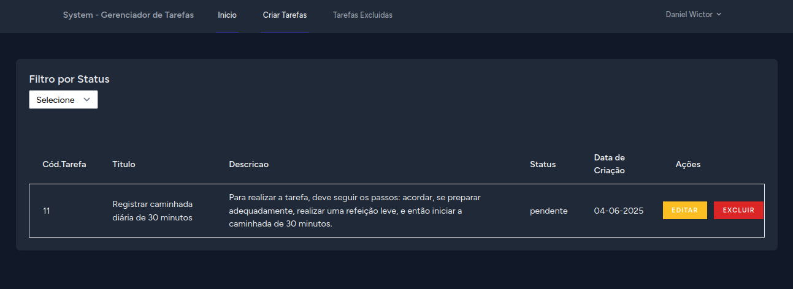
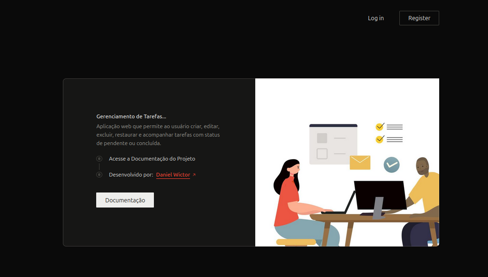

# 📋 TaskManager — Gerenciador de Tarefas


> Um sistema simples e eficiente para criação, organização e acompanhamento de tarefas.

---

## 🚀 Funcionalidades

- ✅ Criar,listar, editar e excluir tarefas
- 🗂️ Organizar tarefas por status (pendente,concluida)
- 🔍 Filtro de tarefas por status, pendente e concluida.
- 💡 Interface reativa com Livewire (sem recarregamento de página)

---

## 🛠️ Tecnologias Utilizadas

- [Laravel](https://laravel.com/) 
- [Livewire](https://livewire.laravel.com/) 
- [Tailwind CSS](https://tailwindcss.com/) 
- [Alpine.js](https://alpinejs.dev/) 
- [MySQL](https://www.mysql.com/) 
---


## 📷 Capturas de Tela


> 

---

## ⚙️ Instalação
1.Clone o repositório do projeto para sua máquina:
```bash
git clone https://github.com/seu-usuario/seu-repositorio.git
```
2. Copiar o arquivo .env
Copie o arquivo .env.example para .env:
```bash
cp .env.example .env
```
Configure as variáveis conforme necessário. Exemplo de configuração mínima:
```bash
APP_NAME=Laravel
APP_ENV=local
APP_KEY=
APP_DEBUG=true
APP_URL=http://localhost

DB_CONNECTION=mysql
DB_HOST=mysql
DB_PORT=3306
DB_DATABASE=laravel
DB_USERNAME=root
DB_PASSWORD=root
```
3. Subir os containers com Docker<br>
 Para iniciar o ambiente:
```bash
docker-compose up -d 
```
4. Dentro do container do PHP rode o comando para liberar as permissões
```bash
chown -R www-data:www-data storage
```
5. Rode as migrations dentro do container do php<br>
Para criar as tabelas do banco de dados:
```bash
docker exec -it app php artisan migrate
```


